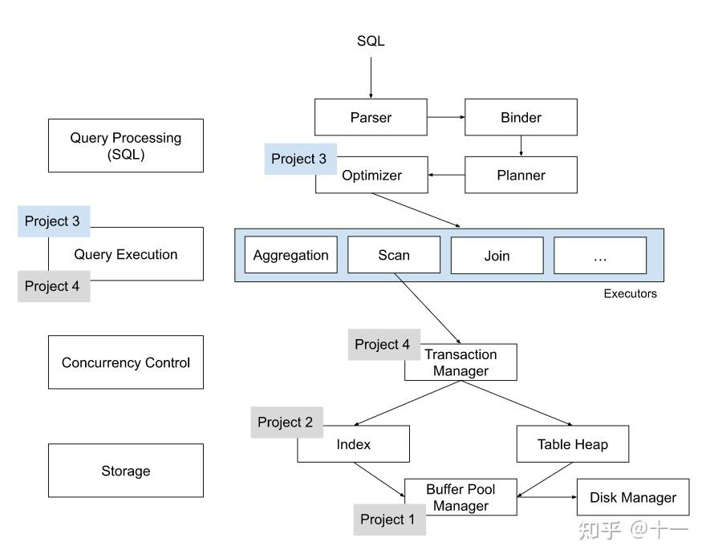

# p1 2024.12.19 ~ 12.22

总的来说,p1要实现一个buffer bool, 它包含三个部分(LRU-K Replacement Policy, Disk Scheduler, Buffer Pool Manager). 

* **LRU-K 替换策略（LRU-K Replacement Policy）：**
  * **功能：** 用于管理缓冲池中的页面，当缓冲池满时，决定哪些页面应被淘汰。
  * **LRU-K 策略：** LRU-K（Least Recently Used with K parameter）算法通过跟踪每个页面的第 K 次最近使用时间，选择那些在第 K 次使用后最久未被访问的页面进行替换。
* **磁盘调度器（Disk Scheduler）：**
  * **功能：** 负责协调缓冲池与磁盘之间的数据传输，处理读写请求。
  * **工作原理：** 将来自缓冲池管理器的读写请求放入一个线程安全的队列中，由后台线程异步地从队列中获取请求，并调用磁盘管理器执行相应的读写操作。
  * **实现：** 需要确保请求队列的线程安全，并有效管理后台线程的生命周期，以保证数据传输的可靠性和效率。
* **缓冲池管理器（Buffer Pool Manager）：**
  * **功能：** 负责在内存中管理页面的缓存，处理页面的获取、固定（pin）、解固定（unpin）、刷新（flush）等操作。
  * **工作原理：** 当需要访问某个页面时，缓冲池管理器首先检查该页面是否在缓冲池中；如果不在，则通过磁盘调度器从磁盘加载页面到缓冲池。当需要腾出空间时，使用 LRU-K 替换策略选择要淘汰的页面。
  * **实现：** 需要维护页面与帧的映射关系、管理页面的固定计数和脏页标记，并与磁盘调度器和替换策略组件协同工作。

## task1 2024.12.19 finish
要实现一个lru-k算法,优先置换访问少于k次, 同为少于k次或大于等于k次, 优先置换其中最早访问的
<!-- 大体思路：维护std::map<size_t, std::deque<frame_id_t>> distance -> frame_id_t 其中少于k次视为distance为0   -->

* 大体思路: 维护  std::map<size_t, size_t> ppriority_evict_; // first_time -> frame_id
和 std::map<size_t, size_t> priority_evict_; // distance -> frame_id
第一个代表小于k次的按时间排序的id, 第二个是等于k次的
当插入或者更新evictble时将上一次的删除 加入新的

## task2 2024.12.20
在startWorkerThread中循环提取任务队列中的DiskRequest,创造一个线程join

### 1.stl如std::unordered_map插入时 会尝试调用其值类型 需要默认构造函数
#### **（1）通过下标 `operator[]` 插入元素**

```
cpp
复制代码
std::unordered_map<int, std::string> my_map;
my_map[1] = "value";
```

在这种情况下：

* 如果 `key=1` 的元素不存在，`operator[]` 会先创建一个新的键值对 `1 -> T()`。
* 这需要调用 `T`（`std::string`）的默认构造函数，将其初始化为默认值（如空字符串 `""`）。
* 然后，再对这个默认构造的值赋值为 `"value"`。

如果是insert, emplace(显示插入构造好的值) 或是 用智能指针则不用(智能指针本身有默认构造函数)

### 使用 std::lock_guard 来管理互斥锁
* **RAII（资源获取即初始化）：**

  * `std::lock_guard` 在创建时自动调用 `lock()` 加锁。
  * 在销毁时（作用域结束）自动调用 `unlock()` 解锁。

* **不可手动解锁：**
  * `std::lock_guard` 没有提供显式的 `unlock` 方法，这样可以防止因误操作而忘记释放锁。

* **轻量级：**
  * 它是一个简单的类模板，通常在编译时会被优化为零开销。

# p2 2024.12.24 ~ 12.30
实现一个可扩展哈希, 要求实现线程安全的查询、写入、删除。

可扩展哈希（**Extendible Hashing**）是一种动态哈希技术，用于解决传统哈希表在面对动态数据时可能出现的性能下降问题。它通过调整哈希表的结构，在需要时扩展或者缩小表的大小，从而提供了高效的插入、删除和查找操作。

以下是关于可扩展哈希的关键点：

### 核心思想

1. **基于位划分**：\
   可扩展哈希利用哈希函数生成的二进制值，对数据进行划分。它根据这些哈希值的前缀来决定数据的存储位置。

2. **目录和桶的分离**：

   * **目录**（Directory）：存储指向桶（Bucket）的指针，每个目录项对应一个桶。
   * **桶**（Bucket）：实际存储数据的地方。 如果某个桶溢出（装不下更多数据），目录的大小可以扩展，避免频繁重新分配整个哈希表。

3. **动态扩展**：

   * 每个桶有一个**局部深度（Local Depth）**，表示当前桶使用了多少位来区分哈希值。
   * 目录有一个**全局深度（Global Depth）**，表示目录中当前最多需要的哈希位数。\
     当桶溢出时，可以选择**分裂桶**，并根据需要扩展目录。

## task1
了解移动语义，实现一个PageGuard类，他是对page的包装，在NewPageGuarded的时候进行读/写锁，在析构函数时自动解锁。  

## task2
### hash
hash的高max_depth_位为directoryIndex, 低local_depth_为BucketIndex. global_depth_同样是低位且global_depth大于local_depth恒成立, 所以多个hash会映射到同一个bucket. 

### Header Page
该部分的max depth固定，主要是用来索引能够索引到存储key的BucketPage位置的Directory Page在Header Page中的位置。索引通过 HashToDirecotryIndex实现
优点：便于扩展，便于并发读写。

### Directory Page
global_depth: 前global_dp作为在directory中的索引,当bucket满时, 通过比较global_depth和local_depth来split  
local_depth: 通过与global_depth比较判断当前bucket的指针数量  

### GetSplitImageIndex 
* 假设Bucket的local\_depth：2，bucket\_idx：01 
* 分裂成两个Bucket后：old\_bucket\_idx：001 new\_bucket\_idx：101

# p3 2025.1.3 ~ 

* Task1：Access Method Executors. 包含 SeqScan、Insert、Delete、IndexScan 四个算子。

* Task2：Aggregation and Join Executors. 包含 Aggregation、NestedLoopJoin、NestedIndexJoin 三个算子。

* Task3：Sort + Limit Executors and Top-N Optimization. 包含 Sort、Limit、TopN 三个算子，以及实现将 Sort + Limit 优化为 TopN 算子。and Top-N Optimization. 包含 Sort、Limit、TopN 三个算子，以及实现将 Sort + Limit 优化为 TopN 算子。

* Leaderboard Task：为 Optimizer 实现新的优化规则，包括 Hash Join、Join Reordering、Filter Push Down、Column Pruning 等等，让三条诡异的 sql 语句执行地越快越好。

* Parser 
一条 sql 语句，首先经过 Parser 生成一棵抽象语法树 AST。Bustub 中采用了 libpg_query 库将 sql 语句 parse 为 AST。
* Binder
在得到 AST 后，还需要将这些词语绑定到数据库实体上，这就是 Binder 的工作。例如有这样一条 sql：

```sql
SELECT colA FROM table1;
```

其中 `SELECT` 和 `FROM` 是关键字，`colA` 和 `table1` 是标识符。Binder 遍历 AST，将这些词语绑定到相应的实体上。实体是 Bustub 可以理解的各种 c++ 类。绑定完成后，得到的结果是一棵 Bustub 可以直接理解的树。把它叫做 Bustub AST。

## task1
要掌握几个类 ：Catalog TableHeap

### SeqScan

12点31分